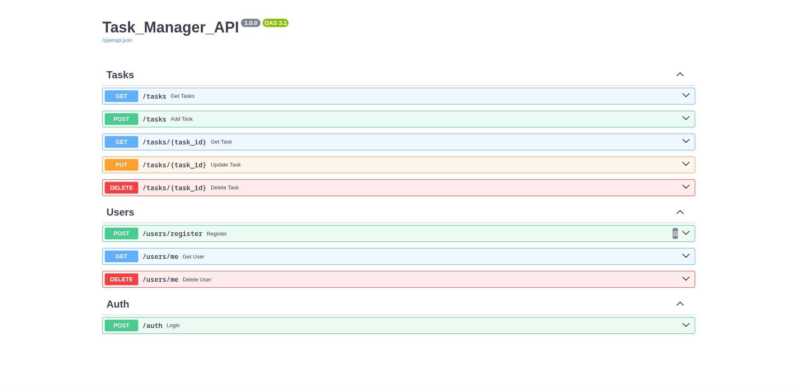

# TaskManagerAPI

<div>


</div>


Task manager pet project powered by FastAPI

---

## Features

- User registration and authentication (JWT-based)
- Task CRUD operations (create, read, update, delete)
- User-specific task management
- Role-based access control for endpoints
- Data validation with Pydantic schemas
- Asynchronous database operations with SQLAlchemy
- Error handling for common database and API issues
- Dockerized deployment and environment configuration
- RESTful API design with FastAPI


## Tech Stack

- Main Stack
   - **[Python 3.11](https://www.python.org/downloads/release/python-3110/)** with **[FastAPI](https://fastapi.tiangolo.com/)**
   - **[PyJWT](https://pyjwt.readthedocs.io/en/stable/)** - User authentication
   - **[Pydantic](https://docs.pydantic.dev/latest/)** - Data validation
- Database
   - **[PostgreSQL](https://www.postgresql.org/)** - Main database
   - **[SQLAlchemy](https://www.sqlalchemy.org/)** - Python ORM
- Package Control System
   - **[Poetry](https://python-poetry.org/)**
- Containerization
   - **[Docker](https://www.docker.com/)**


## Install
- ### Docker instance
   ```
   git clone https://github.com/DenisKurko/TaskManagerAPI.git

   docker compose up
   ```

- ### Poetry
   ```
   git clone https://github.com/DenisKurko/TaskManagerAPI.git

   docker compose up -d

   poetry lock
   poetry run python src/main.py
   ```

## Docs

SwagerUI docs: http://localhost:8000/docs#/



---

#### Auth Endpoints (`/auth`)
- **POST /**  
  Login with username and password (OAuth2).  
  Request: Form data: `username`, `password`  
  Response:
  ```json
  {
    "access_token": "string",
    "token_type": "bearer"
  }
  ```
  Also sets a cookie named `auth` with the JWT token.

---

#### User Endpoints (`/users`)
- **POST /register**  
  Register a new user.  
  Request:
  ```json
  {
    "username": "string",
    "password": "string"
  }
  ```
  Response:
  ```json
  {
    "user_id": int
  }
  ```

- **GET /me**  
  Get current authenticated user's info.  
  Requires authentication.  
  Response:
  ```json
  {
    "user_id": int,
    "username": "string"
  }
  ```

- **DELETE /me**  
  Delete current authenticated user.  
  Requires authentication.  
  Response:
  ```json
  {
    "user_id": int
  }
  ```

---

#### Task Endpoints (`/tasks`)
- **POST /**  
  Create a new task for the authenticated user.  
  Request:
  ```json
  {
    "title": "string",
    "description": "string",
    "status": "string"
  }
  ```
  Response:
  ```json
  {
    "task_id": int
  }
  ```

- **GET /**  
  Get all tasks for the authenticated user.  
  Response:
  ```json
  [
    {
      "id": int,
      "author_id": int,
      "title": "string",
      "description": "string",
      "status": "string"
    }
    // ...more tasks
  ]
  ```

- **GET /{task_id}**  
  Get a specific task by ID for the authenticated user.  
  Response:
  ```json
  {
    "id": int,
    "author_id": int,
    "title": "string",
    "description": "string",
    "status": "string"
  }
  ```

- **PUT /{task_id}**  
  Update a specific task by ID for the authenticated user.  
  Request:
  ```json
  {
    "title": "string",
    "description": "string",
    "status": "string"
  }
  ```
  Response:
  ```json
  {
    "id": int,
    "author_id": int,
    "title": "string",
    "description": "string",
    "status": "string"
  }
  ```

- **DELETE /{task_id}**  
  Delete a specific task by ID for the authenticated user.  
  Response:
  ```json
  {
    "task_id": int
  }
  ```